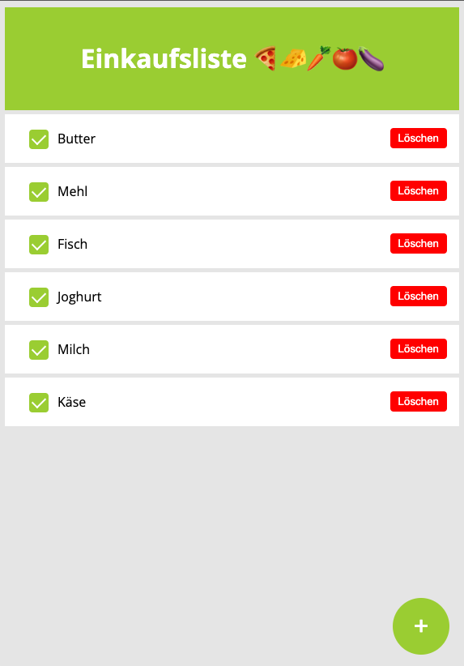

### Hi das ist mein erstes Django Projekt

# Einkaufsliste 🍕🧀🥕🍅🍆

zum Starten brauchst du

- python manage.py runserver

---

Sehen kannst du die Liste dann bei dir lokal auf:

http://127.0.0.1:8000/
oder http://localhost:8000/

---

Das Admin Interface erreichst du unter:

http://127.0.0.1:8000/admin/
oder http://localhost:8000/admin/

---

So sieht das ganze momentan aus:

---

Das Grundgerüst habe ich nach der Anleitung aus diesem Tutorial erstellt und dann erweitert :)
https://www.youtube.com/watch?v=Tl0RsoMMSic

